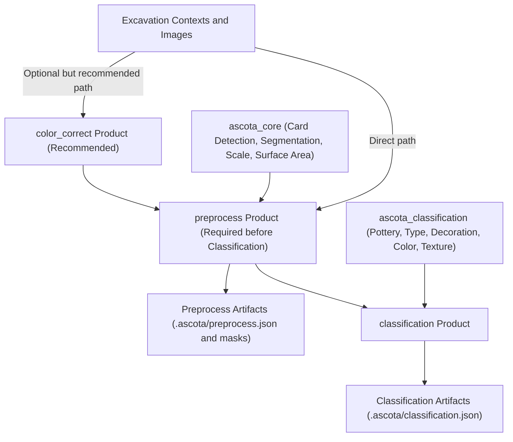

# ASCOTA

**ASCOTA (Archaeological Sherd Color, Texture & Analysis)** is a research framework for the **computational study of archaeological ceramics**. The project develops methods for image standardization, segmentation, classification, and measurement to support archaeological research at **The University of Hong Kong (HKU)**.

> Manual labeling and measurement of terabytes of excavation images is slow and labor-intensive.  
> ASCOTA aims to **automate the backlog** of image processing, standardize new field data, and provide tools for archaeologists to analyze and classify sherds more efficiently.


## About

- **Project Created By:** [M. Shahab Hasan](https://www.linkedin.com/in/shahabai/)  
- **University Supervisor:** [Dr. Peter J. Cobb](https://arthistory.hku.hk/index.php/people/peter-j-cobb/) (School of Humanities, HKU)
- **Research Context:** Archaeological fieldwork under APSAP [(Ararat Plain Southeast Archaeological Project)](https://hdt.arts.hku.hk/apsap-project)


## Pipeline Overview

ASCOTA is organized into **three phases**, with modular Python packages and tools for each stage:

### 1. Core Image Processing
- **Module:** `ascota_core`  
- **Purpose:** Standardize and prepare raw excavation images.  
- **Functions:**  
  - Segmentation & ROI detection (using **Segmentation** + **OpenCV**)  
  - Color card detection, classification, and **color correction**  
  - Pixel-to-centimeter **scale estimation** using measurement cards  
  - Surface area estimation of sherds  
  - Generate swatch images from segmented sherds

Outputs clean, standardized, and calibrated images ready for classification.

---

### 2. Classification & Labeling
- **Module:** `ascota_classification` 
- **Goal:** Automatically classify and label pottery sherds.  
- **Techniques:**  
  - Deep learning neural networks  
  - Vision Transformers (ViTs)  
  - Computer Vision models for object detection and pattern recognition  
- **Targets:**  
  - Sherd type (e.g., rim, base, body fragment)  
  - Color range classification  
  - Texture detection  
  - Pattern/design recognition  

---

### 3. End-to-End Automation & UI
- **Goal:** Deliver 3 accessible tool for archaeologists and non-technical users.  
- **Planned Outputs:**  
  - End-to-end automation scripts  
  - A user-friendly web-based application  
  - Generalized framework that works beyond APSAP contexts  

---

## Repository Structure

```
ASCOTA/
├─ src/                     # Core source code
│  ├─ ascota_core/          # segmentation, color, scale modules
│  └─ ascota_classification/ # classification models
├─ color_correct/           # user application for clustering & color correction
├─ tests/                   # Unit tests, sample data & Streamlit demo apps
├─ docs/                    # MkDocs + Material documentation site
├─ README.md                # Project overview (this file)
└─ requirements.txt         # Dependencies
```

---

## Documentation

Full documentation is built with **[MkDocs + Material](https://squidfunk.github.io/mkdocs-material/)**.  
It includes API reference (via `mkdocstrings`), tutorials, and research notes.

```bash
mkdocs serve
```

Open locally on your browser at [http://localhost:8000](http://localhost:8000) or view online at [https://shabgaming.github.io/ascota](https://shabgaming.github.io/ascota/).

---

## Products

ASCOTA currently includes three main product applications:

- **Color Correct** (`color_correct`)  
  Batch clustering + color correction workflow for excavation images.  
  See: [`color_correct/README.md`](https://github.com/ShabGaming/ascota/blob/main/color_correct/README.md)

- **Preprocess** (`preprocess`)  
  3-stage preprocessing workflow (card detection, segmentation, scale/surface area).  
  See: [`preprocess/README.md`](https://github.com/ShabGaming/ascota/blob/main/preprocess/README.md)

- **Classification** (`classification`)  
  Classification workflows for pottery/type/decoration/color/texture with export.  
  See: [`classification/README.MD`](https://github.com/ShabGaming/ascota/blob/main/classification/README.MD)

### Recommended run order

1. **Color Correct** (recommended, not required)
2. **Preprocess** (required before Classification)
3. **Classification**

`Classification` expects preprocessed context/images.  
Running `Color Correct` before `Preprocess` and `Classification` is recommended for better consistency, but it is optional.

---

## System Workflow Diagram



`Preprocess` is required before running `Classification`.  
`Color Correct` is recommended first for better image consistency, but ASCOTA can still run without it.

---

## Getting Started

Clone and install dependencies:

```bash
git clone https://github.com/ShabGaming/ascota.git
cd ASCOTA
python -m venv .venv
source .venv/bin/activate  # On Windows: .venv\Scripts\activate
pip install -r requirements.txt
```

Run a demo Streamlit app:

```bash
streamlit run tests/streamlits/color_correct_streamlit.py # Demo app for color correction
```

---

## Utils

### SAM wand UI

This will open the SAM wand UI. Used to remove background from images quickly and easily. The transparent image or mask will be saved in the existing folder.

```bash
python -m utils.sam_wand_ui
```

## Research Vision

ASCOTA is more than a software project—it is part of a **research initiative**
to advance archaeological methods with **AI-powered image analysis**:

* Reduce manual labor in sherd classification
* Make excavation data more searchable and analyzable
* Provide reproducible, standardized digital workflows
* Bridge the gap between **AI research** and **archaeological practice**

This work will contribute to academic publication in collaboration with
**Dr. Peter J. Cobb** and the APSAP project.


## License

[Apache License 2.0](LICENSE) — Open for academic and research use.


## Acknowledgements

* **APSAP Project** for providing excavation data and research context.
* **HKU Applied AI Program** for academic support.
* **Segment Anything Model (SAM)**, **OpenCV**, **briaai/RMBG-1.4**, and other open-source tools
  powering this work.
